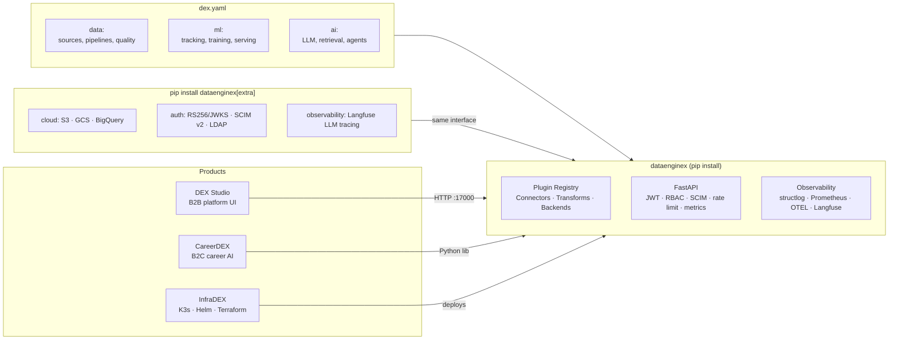

# TheDataEngineX

Unified Data + ML + AI framework — config-driven, self-hosted, production-ready

[](https://github.com/TheDataEngineX/DEX/blob/main/LICENSE)
[](https://www.python.org/downloads/)
[](https://pypi.org/project/dataenginex/)
[](https://docs.thedataenginex.org)
[](https://github.com/orgs/TheDataEngineX/discussions)

---

One `dex.yaml` defines your entire pipeline — from data ingestion through ML training to AI agents.
Opinionated defaults that work out of the box, swap any layer via extras.

> **Self-hosted.** Your data never leaves your infrastructure.
> **Config-driven.** One YAML file defines everything.
> **Production-grade.** DuckDB, FastAPI, structlog, Prometheus, OpenTelemetry out of the box.

---

## The Platform



---

## Repositories

| Repo | What it does | Status |
| --- | --- | --- |
| [**DEX**](https://github.com/TheDataEngineX/DEX) | Core framework: config, CLI, FastAPI, ML registry, LLM routing (LiteLLM/vLLM), AI agents, RBAC, SCIM v2 | [](https://pypi.org/project/dataenginex/) |
| [**dex-studio**](https://github.com/TheDataEngineX/dex-studio) | B2B web UI: pipelines, ML experiments, AI playground, SQL console (Reflex/Python→React) | Alpha |
| [**careerdex**](https://github.com/TheDataEngineX/careerdex) | B2C career AI: job matching, resume analysis, interview prep, application tracking (Reflex) | Alpha |
| [**infradex**](https://github.com/TheDataEngineX/infradex) | IaC: K3s, Helm charts, Terraform — Authentik, Langfuse, Qdrant, Prometheus, Grafana, ArgoCD | Alpha |

---

## Quick Start

```bash
pip install dataenginex
dex validate dex.yaml
dex serve --config dex.yaml   # → http://localhost:17000
```

```bash
# From source
git clone https://github.com/TheDataEngineX/DEX && cd DEX
uv sync && uv run poe dev     # → http://localhost:17000
```

**Optional extras:**

```bash
pip install "dataenginex[cloud]"         # S3 · GCS · BigQuery connectors
pip install "dataenginex[auth]"          # RS256/JWKS · SCIM v2 · LDAP sync
pip install "dataenginex[observability]" # Langfuse LLM tracing
pip install 'litellm>=1.83.3' --no-deps  # 100+ LLM providers (separate install)
```

---

## Why DataEngineX

| | DataEngineX | DIY stack |
| --- | --- | --- |
| **Config** | One `dex.yaml` for data + ML + AI | Separate configs per tool |
| **Install** | `pip install dataenginex` | 10+ packages to wire together |
| **Backends** | Swap via extras, same interface | Rewrite integration code |
| **Self-hosted** | Works on laptop, VPS, or K8s | Cloud lock-in or complex setup |
| **Observability** | structlog + Prometheus + OTEL + Langfuse | Manual instrumentation |
| **Enterprise** | RBAC, SCIM v2, LDAP, OIDC ready | Build it yourself |

---

## Community

| | |
| --- | --- |
| **Documentation** | [docs.thedataenginex.org](https://docs.thedataenginex.org) |
| **Discussions** | [github.com/orgs/TheDataEngineX/discussions](https://github.com/orgs/TheDataEngineX/discussions) |
| **Bug reports** | Open an issue in the relevant repo |
| **Contributing** | [CONTRIBUTING.md](https://github.com/TheDataEngineX/.github/blob/main/CONTRIBUTING.md) |
| **Security** | [SECURITY.md](https://github.com/TheDataEngineX/.github/blob/main/SECURITY.md) |
| **Website** | [thedataenginex.org](https://thedataenginex.org) |

---

**MIT License** · **Python 3.13+** · **Self-hosted** · **Production-grade**
