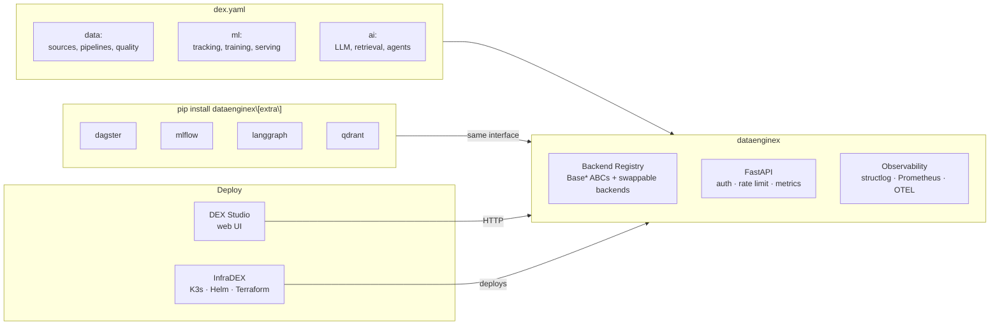

# TheDataEngineX

Unified Data + ML + AI framework — config-driven, self-hosted, production-ready

[](https://github.com/TheDataEngineX/dataenginex/blob/main/LICENSE)
[](https://www.python.org/downloads/)
[](https://pypi.org/project/dataenginex/)
[](https://docs.dataenginex.org)
[](https://github.com/orgs/TheDataEngineX/discussions)

---

One `dex.yaml` defines your entire pipeline — from data ingestion through ML training to AI agents.
Opinionated defaults that work out of the box, swap any layer for industry tools via extras.

> **Self-hosted.** Your data never leaves your infrastructure.
> **Config-driven.** One YAML file defines everything.
> **Production-grade.** DuckDB, FastAPI, structlog, Prometheus metrics out of the box.

---

## The Platform



---

## Repositories

| Repo | What it does | Status |
| --- | --- | --- |
| [**dataenginex**](https://github.com/TheDataEngineX/dataenginex) | Core framework: config system, backend registry, CLI, API, ML, AI agents | [](https://pypi.org/project/dataenginex/) |
| [**dex-studio**](https://github.com/TheDataEngineX/dex-studio) | Web UI: single pane of glass for projects, pipelines, ML, agents (NiceGUI) | Alpha |
| [**infradex**](https://github.com/TheDataEngineX/infradex) | IaC + monitoring: Terraform, Helm, K3s, Prometheus, Grafana | Alpha |

---

## Quick Start

```bash
pip install dataenginex
dex init my-project --template full-stack
dex validate dex.yaml
dex serve                    # → http://localhost:17000
```

```bash
# From source
git clone https://github.com/TheDataEngineX/dataenginex && cd dataenginex
uv sync && uv run poe dev   # → http://localhost:17000
```

**Optional extras:**

```bash
pip install dataenginex[dagster]     # Dagster orchestration
pip install dataenginex[mlflow]      # MLflow tracking
pip install dataenginex[agents]      # LangGraph agent runtime
pip install dataenginex[vectors]     # Qdrant + LanceDB
pip install dataenginex[embeddings]  # sentence-transformers + ONNX
pip install dataenginex[all]         # Everything
```

---

## Why DataEngineX

| | DataEngineX | DIY stack |
| --- | --- | --- |
| **Config** | One `dex.yaml` for data + ML + AI | Separate configs per tool |
| **Install** | `pip install dataenginex` | 10+ packages to wire together |
| **Backends** | Swap via extras, same interface | Rewrite integration code |
| **Self-hosted** | Works on laptop, VPS, or K8s | Cloud lock-in or complex setup |
| **Observability** | structlog + Prometheus + OTEL built-in | Manual instrumentation |

---

## Community

| | |
| --- | --- |
| **Documentation** | [docs.dataenginex.org](https://docs.dataenginex.org) |
| **Discussions** | [github.com/orgs/TheDataEngineX/discussions](https://github.com/orgs/TheDataEngineX/discussions) |
| **Bug reports** | Open an issue in the relevant repo |
| **Contributing** | [CONTRIBUTING.md](https://github.com/TheDataEngineX/.github/blob/main/CONTRIBUTING.md) |
| **Security** | [SECURITY.md](https://github.com/TheDataEngineX/.github/blob/main/SECURITY.md) |
| **Website** | [dataenginex.org](https://dataenginex.org) |

---

**MIT License** · **Python 3.12+** · **Self-hosted** · **Production-grade**
