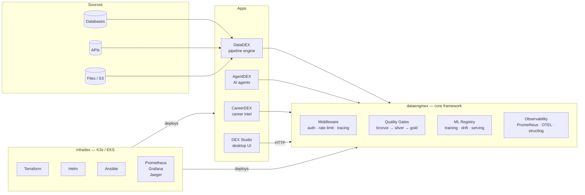

# TheDataEngineX

AI-ready data infrastructure — from notebook to production

[](https://github.com/TheDataEngineX/DEX/blob/main/LICENSE)
[](https://www.python.org/downloads/)
[](https://pypi.org/project/dataenginex/)
[](https://docs.thedataenginex.org)
[](https://github.com/orgs/TheDataEngineX/discussions)

---

We build a self-hosted, production-grade platform for data engineering and AI.
One framework, six components — goes from raw data to trained models to deployed agents,
with observability built in at every layer.

> **Self-hosted.** Your data never leaves your infrastructure.
> **Composable.** Use only what you need — each component works standalone.
> **Production-grade.** Medallion pipelines, ML drift detection, structured logging, Prometheus metrics, OpenTelemetry tracing out of the box.

---

## The Platform



---

## Components

| Repo | What it does | Status | CI |
| --- | --- | --- | --- |
| [**DEX**](https://github.com/TheDataEngineX/DEX) — `dataenginex` | Core framework: medallion pipelines, ML registry, auth, observability, plugin system | [](https://pypi.org/project/dataenginex/) | [](https://github.com/TheDataEngineX/DEX/actions/workflows/ci.yml) |
| [**DataDEX**](https://github.com/TheDataEngineX/datadex) — `datadex` | YAML-defined pipelines: ingest → transform → quality → lineage | Alpha | [](https://github.com/TheDataEngineX/datadex/actions/workflows/ci.yml) |
| [**AgentDEX**](https://github.com/TheDataEngineX/agentdex) — `agentdex` | AI agent runtime: persistent memory, tool registry, multi-model routing, audit trails | Alpha | [](https://github.com/TheDataEngineX/agentdex/actions/workflows/ci.yml) |
| [**CareerDEX**](https://github.com/TheDataEngineX/careerdex) — `careerdex` | Career intelligence: job matching, salary prediction, skill gap analysis | In development | [](https://github.com/TheDataEngineX/careerdex/actions/workflows/ci.yml) |
| [**DEX Studio**](https://github.com/TheDataEngineX/dex-studio) — `dex-studio` | Cross-platform desktop UI: unified control plane for the full stack | v0.1.0 Alpha | [](https://github.com/TheDataEngineX/dex-studio/actions/workflows/ci.yml) |
| [**InfraDEX**](https://github.com/TheDataEngineX/infradex) — `infradex` | IaC + monitoring: Terraform, Helm, Ansible, Prometheus, Grafana, Jaeger | Alpha | [](https://github.com/TheDataEngineX/infradex/actions/workflows/ci.yml) |

---

## Quick Start

**Install the core package:**

```bash
uv add dataenginex           # core (FastAPI server included)
```

**Run from source:**

```bash
git clone https://github.com/TheDataEngineX/DEX && cd DEX
uv run poe setup
uv run poe dev               # → http://localhost:8000
```

**Try the examples:**

```bash
curl http://localhost:8000/health
curl http://localhost:8000/metrics

ls examples/
# 01_medallion_pipeline.py  04_ml_training.py  07_plugin_system.py
# 02_api_quickstart.py      05_data_catalog.py  08_spark_ml.py
# 03_auth_jwt.py            06_observability.py  ...
```

**Full observability stack (requires infradex):**

```bash
git clone https://github.com/TheDataEngineX/infradex && cd infradex
docker compose -f docker-compose.monitoring.yml up -d
# Grafana    → http://localhost:3000  (admin / admin)
# Prometheus → http://localhost:9090
# Jaeger     → http://localhost:16686
```

---

## Roadmap

What's shipping next across the platform:

### Now — Core Completion

- MLflow integration — replace custom JSON model registry with MLflow tracking + lifecycle stages
- DataSecops module — PII detection, field masking, structured audit logs
- PySpark + Databricks connectors for `datadex` pipeline engine
- Cloud storage backends (S3, GCS, BigQuery) in `dex` lakehouse
- Complete DB connectors (Postgres, Kafka, MySQL) in `datadex`

### Next — Load Testing + Observability

- Locust load tests across all API services
- Grafana dashboard per component wired to the infradex monitoring stack
- Full Terraform + Ansible + ArgoCD deploy verified end-to-end

### Then — Demo Projects

- Language-Learning Agent (`agentdex`) — memory, planning, tool use, multi-model routing
- Book Recommender — Open Library → embeddings → Qdrant → recommendations
- Movie Recommender — MovieLens → collaborative filtering + content-based fallback

### Later — Infrastructure & Distribution

- Docker images published to GHCR (`ghcr.io/thedataenginex/*`)
- Docs site live at [thedataenginex.org](https://thedataenginex.org) via Netlify
- Public CareerDEX demo — semantic job search powered by the platform

---

## Why DEX

| | DEX | DIY stack |
| --- | --- | --- |
| **Medallion pipelines** | Built-in Bronze/Silver/Gold with quality gates | Wire together dbt + Airflow + custom validators |
| **ML lifecycle** | Registry, drift detection (PSI), staging → prod promotion | MLflow + custom scripts |
| **Observability** | Prometheus metrics, OTEL tracing, structlog — zero config | Manually instrument every service |
| **AI agents** | Persistent memory, tool registry, cost tracking, audit log | LangChain boilerplate per project |
| **Deployment** | One Helm chart per service, ArgoCD GitOps, Terraform modules | Write your own IaC from scratch |
| **Plugin system** | Drop-in extensions via entry points | Fork and modify the framework |

---

## Community

| | |
| --- | --- |
| 📖 **Documentation** | [docs.thedataenginex.org](https://docs.thedataenginex.org) |
| 💬 **Discussions** | [github.com/orgs/TheDataEngineX/discussions](https://github.com/orgs/TheDataEngineX/discussions) |
| 🐛 **Bug reports** | Open an issue in the relevant repo |
| 🤝 **Contributing** | [CONTRIBUTING.md](https://github.com/TheDataEngineX/.github/blob/main/CONTRIBUTING.md) |
| 🔒 **Security** | [SECURITY.md](https://github.com/TheDataEngineX/.github/blob/main/SECURITY.md) |
| 🌐 **Website** | [thedataenginex.org](https://thedataenginex.org) |

---

**MIT License** · **Python 3.12+** · **Self-hosted** · **Production-grade**
